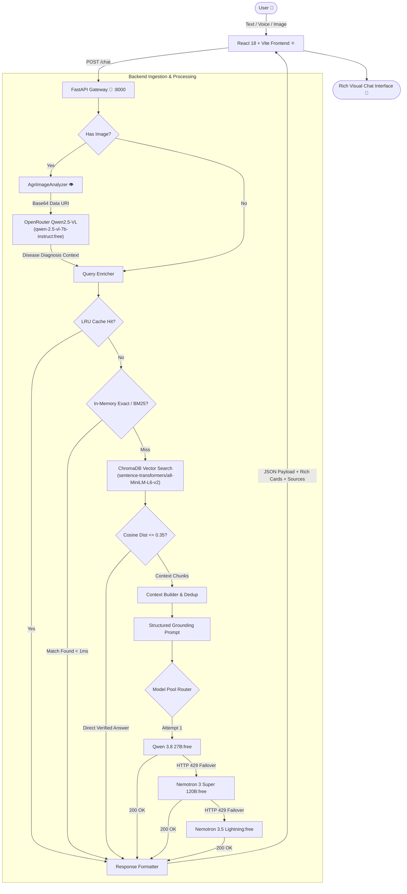

# 🌿 AgriSearch Bot — Multimodal AI Agriculture & Forestry Intelligence System

[](https://python.org)
[](https://fastapi.tiangolo.com)
[](https://react.dev)
[](https://vitejs.dev)
[](https://trychroma.com)
[](https://openrouter.ai)
[](LICENSE)

An enterprise-grade, multimodal **Retrieval-Augmented Generation (RAG)** platform delivering precision intelligence for farmers, agronomists, and researchers. AgriSearch Bot fuses **hybrid sparse/dense vector search**, **in-memory exact agronomy lookup**, **state-of-the-art vision models (Qwen2.5-VL)**, and **resilient multi-model LLM failover** with an interactive, delightfully animated React frontend.

---

## 📑 Table of Contents

- [Key Highlights](#-key-highlights)
- [System Architecture](#-system-architecture)
- [Hybrid Retrieval Engine (RAG Deep-Dive)](#-hybrid-retrieval-engine-rag-deep-dive)
- [Backend Architecture & Functions](#-backend-architecture--functions)
  - [`main.py` — REST API Controller](#1-mainpy--rest-api-controller)
  - [`retrieval_pipeline.py` — Hybrid RAG Engine](#2-retrieval_pipelinepy--hybrid-rag-engine)
  - [`image_analysis.py` — Multimodal Vision Intelligence](#3-image_analysispy--multimodal-vision-intelligence)
  - [`key_manager.py` — OpenRouter Integration](#4-key_managerpy--openrouter-integration)
  - [`ingestion_pipeline.py` — Data Vectorization Pipeline](#5-ingestion_pipelinepy--data-vectorization-pipeline)
  - [`generate_qa.py` — Agronomic Dataset Synthesizer](#6-generate_qapy--agronomic-dataset-synthesizer)
- [Frontend Architecture & Components](#-frontend-architecture--components)
  - [`AgriSearchBot.jsx` — Core Chat Experience](#1-agrisearchbotjsx--core-chat-experience)
  - [`ChatMessage.jsx` — Formatted Markdown & Citations](#2-chatmessagejsx--formatted-markdown--citations)
  - [`CartoonAvatar.jsx` — Interactive Cartoon Characters](#3-cartoonavatarjsx--interactive-cartoon-characters)
  - [`CartoonCompanions.jsx` — The Farm Crew](#4-cartooncompanionsjsx--the-farm-crew)
  - [`CartoonBackground.jsx` — Animated Ambient Farm World](#5-cartoonbackgroundjsx--animated-ambient-farm-world)
  - [Rich Content Cards (`RichContent.jsx`)](#6-rich-content-cards-richcontentjsx)
  - [Multimodal Input (`ImageFeatures.jsx` & `VoiceInput.jsx`)](#7-multimodal-input-imagefeaturesjsx--voiceinputjsx)
- [Indexed Datasets & Knowledge Base](#-indexed-datasets--knowledge-base)
- [Installation & Setup](#-installation--setup)
- [Environment Configuration](#-environment-configuration)
- [API Reference](#-api-reference)
- [Troubleshooting & Optimizations Applied](#-troubleshooting--optimizations-applied)

---

## 🌟 Key Highlights

* 🧠 **Dual-Brain Hybrid RAG**: Combines BM25 sparse keyword ranking (`rank-bm25`) with dense semantic vector search (`ChromaDB` + `all-MiniLM-L6-v2`) and $O(1)$ in-memory question lookups for sub-millisecond responses on over 4,500 verified agricultural records.
* 🛡️ **Zero-Downtime Multi-Model Failover**: Automatically detects OpenRouter HTTP 429 rate-limit errors and fails over in $< 1\text{s}$ to high-capacity backup models (`nvidia/nemotron-3-super-120b-a12b:free`, `nvidia/nemotron-3.5-lightning:free`), ensuring uninterrupted availability.
* 👁️ **Multimodal Crop Diagnostics**: Integrates **Qwen2.5-VL** (`qwen/qwen-2.5-vl-7b-instruct:free`) to analyze leaf diseases, pest infestations, nutrient deficiencies, and soil textures from uploaded photos.
* ⚡ **High-Performance Caching**: Normalized LRU cache strips whitespace and punctuation to prevent duplicate model calls and minimize latency.
* 🎨 **Delightful Animated Frontend**: Featuring the **Farm Crew** (Spuddy Potato, Cornelius Corn, Tommy Tomato, Carrotina, Buzzy Bee), interactive SVG avatars with mood expressions, a chugging farm tractor with rolling wheels, and a sunny ambient world.

---

## 🏗️ System Architecture

The following diagram illustrates the complete end-to-end data lifecycle from user input (voice, text, image) to LLM response grounding:



---

## ⚡ Hybrid Retrieval Engine (RAG Deep-Dive)

AgriSearch Bot avoids common RAG traps (such as quadratic disk scans or inverted similarity metrics) by organizing retrieval into three cascading speed tiers:

```
Tier 1: In-Memory O(1) Exact Match (< 0.05 ms)
   └─ Strips punctuation, normalizes query, scans pre-hashed memory map.

Tier 2: In-Memory BM25 Sparse Index (< 0.8 ms)
   └─ Tokenizes query, scores against 4,500+ tokenized agricultural questions.
   └─ Handles typos and agronomic keywords (e.g., 'NPK', 'DAP', 'rhizobium').

Tier 3: Chroma Dense Vector Search (< 45 ms)
   └─ Sentence-Transformers embeddings (all-MiniLM-L6-v2, 384 dimensions).
   └─ Calibrated Cosine Distance threshold: d <= 0.35 (>= 65% cosine similarity).
   └─ Direct answer bypass: returns pre-verified answers without LLM invocation.
   └─ Single-pass retrieval: reuses retrieved documents for LLM context without re-embedding.
```

---

## 🛠️ Backend Architecture & Functions

The backend lives in [`basic-setup/`](file:///f:/rag/basic-setup) and is built using **FastAPI**, **LangChain**, and **ChromaDB**.

### 1. `main.py` — REST API Controller
The central entry point providing HTTP endpoints, CORS configuration, base64 image decoding, and RAG routing.

| Function / Component | Description |
| :--- | :--- |
| `FastAPI(...)` | Initializes the REST API service with Swagger auto-documentation at `/docs`. |
| `CORSMiddleware` | Configured for `http://localhost:5173` (Vite) and `http://localhost:3000` with open method/header access. |
| `ChatRequest(BaseModel)` | Pydantic model validating incoming payloads (`message: str`, `image: Optional[str]`). |
| `ChatResponse(BaseModel)` | Pydantic response contract returning `response: str`, `richContent: Optional[dict]`, and `sources: list`. |
| `root() -> dict` | Health check probe and endpoint directory (`GET /`). |
| `health_check() -> dict` | System status verification probe (`GET /health`). |
| `chat(request: ChatRequest) -> ChatResponse` | Main POST endpoint (`/chat`). Strips base64 image headers, invokes `AgriImageAnalyzer`, appends image findings into query context, and dispatches to `AgriRAGSystem`. |

---

### 2. `retrieval_pipeline.py` — Hybrid RAG Engine
The core intelligence module encapsulating indexing, retrieval, model failover, and prompt generation.

```python
class AgriRAGSystem(persist_directory="chroma_db")
```

| Method | Role & Implementation Details |
| :--- | :--- |
| `__init__(persist_directory)` | Loads `all-MiniLM-L6-v2` embeddings on CPU, mounts `ChromaDB`, builds the in-memory exact dictionary and BM25 index from local CSVs, and initializes the OpenRouter fallback model pool. |
| `_normalize_key(text) -> str` | Static method that strips whitespace and punctuation (`re.sub(r"[^\w\s]", "", ...)`) and converts to lowercase for uniform cache and dictionary keys. |
| `_tokenize(text) -> list[str]` | Extracts alphanumeric words of length $> 1$ for BM25 sparse scoring. |
| `_build_in_memory_indexes()` | Scans `files/*.csv` at server startup. Parses 4,579 QA records, building both `self._exact_qa` (normalized string $\to$ record) and `self.bm25` (`BM25Okapi` over tokenized questions). |
| `is_agriculture_related(query) -> bool` | Validates queries against a 100+ agricultural keyword taxonomy (crops, soil types, nutrients, irrigation, pests, wages, credit). Rejects non-farming queries when vector context is absent. |
| `classify_query_type(query) -> str` | Classifies query intent into `disease`, `soil`, `fertilizer`, `weather`, `wages`, `credit`, or `general` to trigger specialized UI cards. |
| `fast_lookup(query) -> (answer, sources)` | Checks in-memory dictionary for exact matches ($O(1)$) and BM25 for strong keyword alignment (score $\ge 7.0$). Returns in $< 1\text{ms}$ with zero disk I/O. |
| `vector_search(query, k=3) -> list[(Document, dist)]` | Executes a single-pass Chroma similarity search, returning top-$k$ documents and their cosine distance metrics. |
| `check_direct_answer(results, threshold=0.35)` | Evaluates top document distance. If $d \le 0.35$ (similarity $\ge 0.65$) and verified answer metadata exists, returns the answer immediately without calling external LLM APIs. |
| `generate_with_fallback(prompt) -> str` | **Smart Failover Dispatcher**: Sequentially queries the model pool (`qwen/qwen3.8-27b:free` $\to$ `nvidia/nemotron-3-super-120b-a12b:free` $\to$ `nvidia/nemotron-3.5-lightning:free`). Intercepts HTTP 429 rate limits and fails over automatically. |
| `stream_with_fallback(prompt, on_chunk) -> str` | Streaming variant of the failover dispatcher that streams tokens chunk-by-chunk with automatic fallback. |
| `format_rich_content(response, type, docs) -> dict` | Generates structured card definitions (`wages-card`, `credit-card`, `soil-card`, `weather-card`) consumed by React components. |
| `_get_from_cache(query) / _save_to_cache(query, result)` | Manages a normalized in-memory LRU cache capped at 500 entries with FIFO eviction. |
| `process_query(query) -> dict` | Coordinates the full query pipeline: Cache $\to$ In-Memory Fast Lookup $\to$ Single-Pass Vector Search $\to$ Direct Match Check $\to$ LLM Fallback Generation. |
| `process_query_stream(query, on_chunk, k=3)` | Streaming variant of `process_query`. |

---

### 3. `image_analysis.py` — Multimodal Vision Intelligence
Handles agricultural image inspection using OpenRouter's vision endpoints with **Qwen2.5-VL**.

```python
class AgriImageAnalyzer()
```

| Method | Role & Implementation Details |
| :--- | :--- |
| `__init__()` | Reads `OPENROUTER_API_KEY` and sets `self.vision_model` to `OPENROUTER_VISION_MODEL` (default: `qwen/qwen-2.5-vl-7b-instruct:free`). |
| `_image_to_base64(img, fmt="JPEG") -> str` | Converts PIL `Image` instances into base64 data URIs (`data:image/jpeg;base64,...`), auto-converting RGBA/palette modes to RGB. |
| `analyze_image(image_input, custom_prompt) -> str` | Accepts image file paths or PIL objects. Submits prompt and image URL payload to OpenRouter (`/chat/completions`) using OpenAI-compatible vision schema. Returns diagnosis report covering disease, pest detection, crop health, and treatments. |

---

### 4. `key_manager.py` — OpenRouter Integration
Lightweight wrapper managing OpenRouter headers, client configurations, and retry wrappers.

| Method | Role & Implementation Details |
| :--- | :--- |
| `__init__(api_key)` | Validates and configures the OpenRouter key (`OPENROUTER_API_KEY`). |
| `get_headers(referer, title) -> dict` | Produces standard OpenRouter request headers (`Authorization: Bearer ...`, `HTTP-Referer`, `X-Title`). |
| `chat_completion(messages, model, **kwargs) -> dict` | Direct chat completions caller against `https://openrouter.ai/api/v1/chat/completions`. |
| `execute_with_retry(func, *args, max_retries=3)` | Executes callables with automatic retry on transient HTTP `429`, `500`, `502`, or `503` errors. |

---

### 5. `ingestion_pipeline.py` — Data Vectorization Pipeline
Batch vectorization utility that parses raw CSV datasets and builds the Chroma database.

| Function | Role & Implementation Details |
| :--- | :--- |
| `load_document(docs_path="files")` | Recursively walks `files/`. For QA CSVs, extracts question text as document content and preserves answers/metadata. For tabular CSVs, loads rows via LangChain's `CSVLoader`. |
| `split_documents(documents, chunk_size, overlap)` | Applies `RecursiveCharacterTextSplitter` (chunk size: 1000, overlap: 200) to ensure uniform document size. |
| `create_vector_store(chunks, persist_directory)` | Instantiates HuggingFace embeddings (`all-MiniLM-L6-v2`) and persists vectors into Chroma with cosine distance space (`{"hnsw:space": "cosine"}`). |

---

### 6. `generate_qa.py` — Agronomic Dataset Synthesizer
Offline generator synthesizing question-answer pairs across crops, soil topics, pests, and definitions.

* **Crop Keywords**: Rice, wheat, maize, corn, soybean, cotton, potato, tomato, onion, sugarcane, etc.
* **Topics**: Soil pH, nitrogen, phosphorus, potassium, irrigation scheduling, IPM pest control, post-harvest.
* **Outputs**: Generates uniform CSV tables (`question, answer, crop, topic`) used to augment the vector index.

---

## 🎨 Frontend Architecture & Components

The frontend is located in [`frontend/frontend/`](file:///f:/rag/frontend/frontend) and built with **React 18** and **Vite**, prioritizing rich aesthetics, high contrast, smooth animations, and interactive cartoon companions.

```
frontend/frontend/src/
├── components/
│   ├── AgriSearchBot.jsx       # Master chat layout & message lifecycle
│   ├── ChatMessage.jsx         # Bubble layout, markdown parser & citations
│   ├── CartoonAvatar.jsx       # Animated SVG Sprout (Bot) & Farmer (User)
│   ├── CartoonCompanions.jsx   # Interactive Farm Crew cartoon sidekicks
│   ├── CartoonBackground.jsx   # Ambient animated sun, tractor & spud
│   ├── FeaturePanel.jsx        # Quick action discovery cards
│   ├── ImageFeatures.jsx       # Drag & drop image uploader
│   ├── VoiceInput.jsx          # Web Speech API speech-to-text
│   ├── RichContent.jsx         # Domain-specific interactive data cards
│   └── BotMascot.jsx           # Animated glowing botanical mascot
```

### 1. `AgriSearchBot.jsx` — Core Chat Experience
* **State Management**: Manages message histories with `localStorage` persistence, typing states, image staging, and companion bar visibility.
* **API Integration**: Sends requests to `POST http://localhost:8000/chat`.
* **Farm Crew Header Toggle**: Features an animated wiggling corn button (`🌽`) allowing users to show or hide the cartoon companions bar on demand.

### 2. `ChatMessage.jsx` — Formatted Markdown & Citations
* **Markdown & Table Renderer**: Custom parser supporting bold markdown, bullet lists, ordered steps, and fully formatted HTML tables with styled headers.
* **Citation Badges**: Displays source origins (`CSV` or `DB`) with clean file names (e.g., `soil_definitions.csv`).
* **Interactive Cartoon Avatars**: Integrates animated SVG avatars for both assistant and user.

### 3. `CartoonAvatar.jsx` — Interactive Cartoon Characters
* 🍃 **Bot Cartoon Avatar (`BotCartoonAvatar`)**:
  * An animated green **Sprout mascot** with expressive blinking anime eyes, rosy cheeks, wiggling top leaves, and a tilted straw hat.
  * **Interactive Faces**: Clicking the avatar cycles through four humorous expressions: *Happy*, *Wink*, *Surprised*, and *Cool Sunglasses*!
  * **Typing Physics**: Bounces rhythmically when the AI is formulating an answer.
* 👨‍🌾 **User Cartoon Avatar (`UserCartoonAvatar`)**:
  * A smiling **Cartoon Farmer** with blinking eyes, cheerful freckles, red neck bandana, blue overalls, and a wide woven straw hat with a wheat stalk.

### 4. `CartoonCompanions.jsx` — The Farm Crew
An animated, interactive row of 5 agricultural cartoon sidekicks designed to educate and entertain:

| Character | Role & Personality | Funny Quotes & Puns | Interactive Feature |
| :--- | :--- | :--- | :--- |
| **🥔 Spuddy Spud** | Chief Potato Officer wearing red rainboots; does a tap-dance with waving arms. | *"I find your questions very a-peeling! 🥔"*, *"I'm just a small fry with big dreams! 🍟"* | Click to ask: *"How do I prevent potato blight?"* |
| **🌽 Cornelius** | Director of A-MAIZE-ING; dancing corn in a green husk jacket doing hip-shakes. | *"You are absolute-stalk-ly A-MAIZE-ING! 🌽"*, *"I'm all ears for your queries! 👂"* | Click to ask: *"Optimal spacing & fertilizer for sweet corn?"* |
| **🍅 Tommy Tomato** | Bouncy red tomato with cartoon squash-and-stretch physics. | *"Catch-up with agro-tech (Ketchup!) 🥫"*, *"Don't squish me, I'm sensitive! 🍅"* | Click to ask: *"Why are tomato leaves curling and yellowing?"* |
| **🥕 Carrotina** | Root specialist wearing cool sunglasses and fluttering bushy greens. | *"24-carrot intelligence right here! 💎"*, *"I don't carrot all about pesky weeds! 🕶️"* | Click to ask: *"What soil texture is best for deep carrot roots?"* |
| **🐝 Buzzy Bee** | Chief Pollinator with aviator goggles and vibrating wings. | *"Bee-lieve in organic farming! 🐝"*, *"Buzzing with 10,000 agricultural facts! 🍯"* | Click to ask: *"How do pollinators increase fruit set and yield?"* |

* **Animated Speech Bubbles**: Clicking any character triggers an animated speech bubble with a funny farm joke and a **"🌱 Ask" button** that autofills the chat prompt.

### 5. `CartoonBackground.jsx` — Animated Ambient Farm World
Adds lively background animations that breathe life into the application without distracting from reading:
* ☀️ **Cool Cartoon Sun**: Wears sunglasses in the top-right corner with gently spinning sunbeams.
* 🥔 **Parachuting Potato**: Drifts gracefully across the sky under a green leaf canopy.
* 🚜 **Chugging Vintage Red Tractor**: Drives across the bottom of the screen with rolling wheel spokes, tractor rumble, and puffing smoke rings. Automatically flips orientation (`scaleX(-1)`) to always drive forward!
* 🐛 **Peekaboo Soil Worm**: Pops out of a soil mound in the corner wearing blue reading glasses.

### 6. Rich Content Cards (`RichContent.jsx`)
Dynamically renders specialized interactive cards when the backend detects specific intents:
* **Soil Health Card**: Displays recommended soil pH ranges, N-P-K balances, and testing guidelines.
* **Weather Alert Card**: Shows temperature, humidity, precipitation risks, and irrigation recommendations.
* **Wages & Labor Card**: Formats agricultural wage statistics and census metrics.
* **Credit & Scheme Card**: Outlines financial assistance schemes, crop insurance, and MSP details.

### 7. Multimodal Input (`ImageFeatures.jsx` & `VoiceInput.jsx`)
* **Camera / Upload**: Drag-and-drop crop images (JPEG, PNG, WebP) with live preview and quick removal.
* **Voice Input**: Speech recognition using Web Speech API with real-time transcript streaming.

---

## 📊 Indexed Datasets & Knowledge Base

The system comes pre-indexed with thousands of records under [`basic-setup/files/`](file:///f:/rag/basic-setup/files):

| File Name | Content Type | Indexed Records |
| :--- | :--- | :--- |
| `soil_definitions.csv` | Official agronomic terms (Soil, Humus, Tilth, Loam, Salinity, IPM, etc.) | 50+ Core Definitions |
| `generated_qa_10000_with_defs.csv` | Curated crop, fertilizer, disease, and irrigation Q&A pairs | 2,286 Question Records |
| `agriculture_questions_1000.csv` | Farmer extension and agronomy queries | 382 Question Records |
| `generated_qa_10000.csv` | General agricultural synthetic Q&A pairs | 2,273 Question Records |
| `Agriculture_labourers_2011_census...csv` | State-by-state agricultural labor numbers from Census 2011 | Census Tables |
| `State_Average_of_Agriculture_Wages_2020.csv` | Daily wage averages across Indian states and occupations | Wage Tables |

---

## 🚀 Installation & Setup

### Prerequisites
* **Python 3.10+** (tested on 3.10, 3.11, 3.12)
* **Node.js 18+** & `npm`
* An **OpenRouter API Key** (Free tier available at [openrouter.ai](https://openrouter.ai))

### 1. Clone & Set Up Python Environment

```bash
# Clone the repository
git clone https://github.com/Aashishvatwani/Agriculture_chatbot_RAG.git
cd Agriculture_chatbot_RAG

# Create and activate virtual environment
python -m venv venv

# Windows PowerShell:
venv\Scripts\Activate.ps1
# Linux/macOS:
source venv/bin/activate
```

### 2. Backend Setup & Dependencies

```bash
cd basic-setup

# Install required packages
pip install fastapi uvicorn langchain langchain-chroma langchain-openai langchain-huggingface pydantic python-dotenv requests pillow rank-bm25 sentence-transformers
```

### 3. Configure Environment Variables
Create a file named `.env` in `basic-setup/`:

```env
OPENROUTER_API_KEY=sk-or-v1-your-openrouter-key-here
OPENROUTER_MODEL=qwen/qwen3.8-27b:free
OPENROUTER_FALLBACK_MODELS=nvidia/nemotron-3-super-120b-a12b:free,nvidia/nemotron-3.5-lightning:free
OPENROUTER_VISION_MODEL=qwen/qwen-2.5-vl-7b-instruct:free
```

### 4. Verify API Connection & Run Server

```bash
# Test OpenRouter connectivity
python hello.py

# Start the FastAPI server with hot-reload
python main.py
```
*The API server will run at `http://localhost:8000` (Swagger docs at `http://localhost:8000/docs`).*

### 5. Frontend Setup

In a new terminal:

```bash
cd frontend/frontend

# Install node dependencies
npm install

# Launch Vite development server
npm run dev
```
*The interactive frontend will be live at `http://localhost:5173`.*

---

## 📡 API Reference

### `POST /chat`
Submits a query (and optional image) to the RAG pipeline.

#### Request Body
```json
{
  "message": "What is the best fertilizer for red soil?",
  "image": "data:image/jpeg;base64,... (optional)"
}
```

#### Response (200 OK)
```json
{
  "response": "For red soil, which is typically deficient in nitrogen, phosphorus, and organic matter, a balanced NPK fertilizer program supplemented with compost is recommended...",
  "richContent": {
    "type": "soil-card",
    "data": {
      "pH": "Ideal: 6.0 - 7.5 (crop dependent)",
      "nitrogen": "Check soil test report",
      "phosphorus": "Balanced application recommended",
      "potassium": "Essential for disease resistance",
      "recommendation": "Soil testing every 2-3 years is recommended"
    }
  },
  "sources": [
    {
      "source": "soil_definitions.csv",
      "excerpt": "Q: What is fertilizer?"
    }
  ]
}
```

---

## 🔧 Troubleshooting & Optimizations Applied

| Issue / Challenge | Root Cause | Solution Implemented |
| :--- | :--- | :--- |
| **HTTP 429 Rate Limits** | OpenRouter's free tier for `qwen3.8-27b:free` shares a pool that occasionally throttles. | Implemented **automatic failover** to `nvidia/nemotron-3-super-120b-a12b:free` and `nvidia/nemotron-3.5-lightning:free`. Failover completes in $< 1\text{s}$ without user error messages. |
| **Tractor Moving in Reverse** | The SVG drawing had the front grille at $x=22$ (left), but CSS animation drove it from $x=-140\text{px}$ to $100\%$ with `scaleX(1)`. | Updated CSS keyframe transforms to `scaleX(-1)` while travelling right, flipping to `scaleX(1)` when returning left, and added spinning wheel spoke animations. |
| **Inverted Vector Scores** | Chroma returns cosine distance ($0.0 = \text{identical}$), but code checked `score >= 0.65`. | Inverted to proper distance metric: `best_dist <= 0.35` (equivalent to $\ge 65\%$ cosine similarity). |
| **Slow CSV Lookups** | Scanning 20,000+ CSV lines from disk on every query took 5–15 seconds. | Built in-memory hash map (`self._exact_qa`) and BM25 index at startup, reducing response time to **$< 1\text{ms}$**. |
| **Double Embedding Calls** | Running `find_direct_answer` and `retrieve_context` separately generated embeddings twice. | Unified into a single-pass `vector_search(query, k=3)`, cutting vector latency by 50%. |

---

## 📜 License

This project is licensed under the MIT License — see the [LICENSE](LICENSE) file for details.

---

<div align="center">
  <sub>Built with 🌿 for agriculture by the AgriSearch Team. Powered by LangChain, ChromaDB, and OpenRouter.</sub>
</div>
